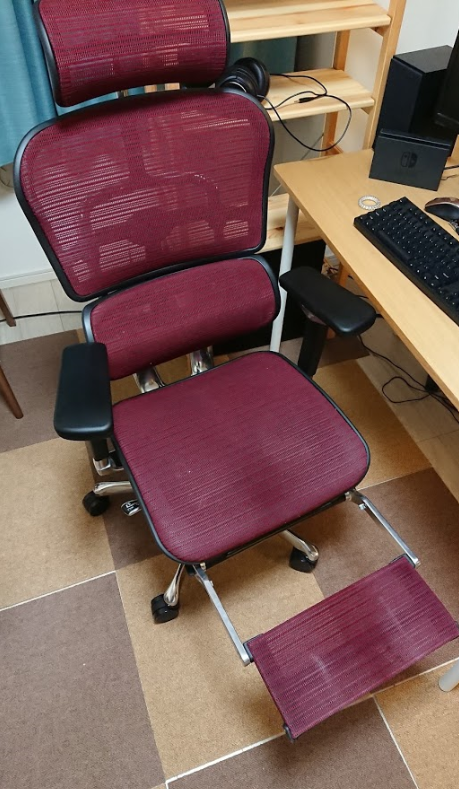

## 最高です

24時間でベッドの次に椅子を使っているので自宅の椅子もいいやつにしました。

エルゴヒューマン最高。

私は、[Ergohuman PRO ottoman](https://www.ergohuman.jp/product/ergohuman_pro_ottoman.php)を買いました。

結構お高い買い物です。
ショールームで実際に座ってから買うといいです！

### なんでかったのか

会社でいい椅子を使う制度があり、[Leap](https://office.uchida.co.jp/products/leap/)といういい椅子を使わせていただいていました。

ところが、会社の都合でちょっとの間だけ安そうな椅子になった時がありました。
その時、肘掛けが気になったり、座面の硬さや位置が気になって、いい椅子の生産性向上の効果を改めて感じました。

### なにがいいのか

#### 調整する箇所が多い

やすそうな椅子って肘掛けの高さ、角度、背もたれの硬さ、角度、椅子の高さ、前後とかって調整できないですよね。

好みの位置に調整できるので、なんか気になって作業できないみたいなことがなくなりました。

#### オットマン

オットマンが良いです。足を伸ばして休憩もできます。動画鑑賞なども捗ってしまいます。

### 課題

やすそうな椅子で作業できなくなっちゃうんじゃないかと思ってしまします。贅沢は敵ですね。