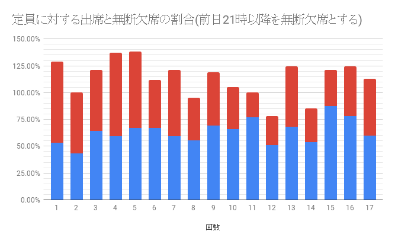

# Meguro.esの出席率を調べた

## まとめ

記事は長いのでまとめだけ読んでください。

- Meguro.esでは何度もお願いをすることで連絡なく来ない人は減った！が、前日の夜以降のキャンセルが多い
- 明日が見えない人がそんなにいるなら業界やばいぞ！ きてね
- いろいろあるから仕方ないよねって時もあるよね

## これを書くきっかけ

まいどまいど、[Meguro.es](https://meguro.es) のネタなんで申し訳ないです。

Meguro.esの運営はとても楽しいのですが、一番面倒なのが会場のキャパを元に募集人数を決めることです。

Meguro.esでは発表枠(LT)7名、一般参加枠(オーディエンス)をX名にして、キャパシティーと相談して変動させています。

例えば、スタッフを除いて、30人が最適、40人で少しきつい...という会場があったら何人の募集をかけるか、みなさんならどうしますか？

僕は発表枠7名、一般参加枠(オーディエンス)45名です。52名×60%で31名を見込みます。

つまり、**全員来たら会場が限界を迎えるような人数**を募集にかけなければならないのです。

イベント主催者はご存知だと思います、歩留まりと言われる数字です。Meguro.esは歩留まりが悪いのです。
理由はいくつもあると思っているのですが、理由と数値をこの記事では紹介します。

## 人数予想をなぜするか

人数予測は、会の継続的な運営のために必要です。
スポンサーをすることの利益を守ること、当日のオペレーション負荷を下げることが理由としてあります。

おおよその人数を設定し、それにあったスポンサー費をいただくことが多いです。

また、運営メンバーの負荷をさげるため、事前にスポンサーから一定のスポンサー費をお預かりし、事前に飲み物と食べ物の発注を行っています。[^budget]

[^budget]: 立て替え払い、発注代行など様々な方法はありますが、予算は事前に決定しています

人数の読みを外してしまい、多く発注しすぎた場合、食品の廃棄だけではなく、スポンサー費の無駄遣いをしてしまいます。
逆に少なく発注してしまった場合も、会の円滑な運営ができず参加者・スポンサーの方にご迷惑をかけてしまいます。

スポンサーとしては、できるだけ多くの人にスポンサーセッションや、会場への来場をしてほしい意図があると思っていますので
キャパシティーに近い人数が集められるように努力しています。(キャパが広い会場の場合はその限りではありません。)

また、盛り上がることは運営のモチベーションにも繋がります。
人数だけではないですが、多くの人を集めることはわかりやすい指標のひとつです。

## Meguro.esの歩留まりが悪い理由

これは、ふわっとした内容である事だと思っています。
事前にテーマがあるわけではなく、募集時にタイトルを発表しているわけではないのでどうしても聞きたいというモチベーションにならないがあります。
これはMeguro.esの特徴の1つで、テーマを定めず、発表枠も10分枠を募集することで、様々なカテゴリのフロントエンドに関わる発表が聞けるようになっています。

いつもありがとうございます。

他にも、参加費が無料であること。事前に決済を行わないこと。
事前に決済をする勉強会やカンファレンスと違い、無料であるため直前にキャンセルするリスクが無いことがあるのだと思っています。

キャンセル処理をせずに参加しないことを繰り返すと、Meguro.esではなんらかの制限をかけることを表明しております。
ぜひ、参加やゆとりを持ったキャンセルをお願いします。

## Meguro.esの数値

こちらが過去17回のイベントの歩留まりです。

青が参加者、赤がキャンセルをせず来場もしなかった方です。

傾向として、参加率が高くなっていることがわかります。ありがとうございます。

なお、参加率改善のため行っている施策はこちらです
- 4回目より、1週間前などに予定が合わない方のリマインダーをする運用をはじめています
- 7回目より、イベントページに当日のキャンセルは控えるようなメッセージを記載しています
- 10回目より、connpassの機能として、同じ時間帯の勉強会に参加できない機能が追加されています

やはり、connpassの重複参加禁止機能の効果が高いことがわかります。

この結果だけを見れば、75%程度の参加率です。こんなものだと思います。

高ければ高いほど望ましいですが、参加者の皆様の急な業務や体調不良などがあると思っていますので、
90%程度が理想的な線だと思っています。少しでもこの値に近づけたいです。

### 直前のキャンセルを欠席として扱った場合

ただし、先程のデータはイベント終了時点での集計結果です。

Meguro.esでは、ほぼ毎回定員を超える申込みが来ています。
もし定員を超えていた場合、直前のキャンセルでは、枠の譲り合いにならないため、
17時以降(開場2時間前)のキャンセルを無断欠席の値に足してみます。

途端に参加率が下がりました。70%弱といったところでしょうか。

また、イベント募集ページには当日のキャンセルはお控えください。と明記してあります。
そのため、前日の21時以降のキャンセルを欠席として扱った場合のデータです。

60%強といったところでしょうか。運営している人間としては、なかなかショックです。

### 割合ではなく人数であらわす

割合だけではわからないので、人数をグラフにしてみました。
次のグラフのうち、黄色い面は定員をあらわします。[^infinity]

[^infinity]: 無制限の発表枠を設けた会については、7名としました。

さきほど、ほぼ毎回定員オーバーしていると言いましたが、最終結果が定員オーバーしているのは第16回だけです。
16回目だけ、定員と積み上げグラフの値が一致していますね。

ここに直前キャンセルを不参加としてグラフに反映させます。

いかがでしょう。17時の時点でも定員割れしていることが多いことがわかります。
案内に沿って、前日21時までに対象を伸ばします。

ほぼ毎回定員オーバーしているのが嘘では無いことがわかると思います。
前日夜から、当日夜までのキャンセルが多いことがおわかりいただけると思います。
当日の体調不良、業務状況などがあるとは思いますので、致し方ないことですね。

経験上、定員を10名超えると途端に申し込みがなくなります。やはり2桁の繰り上がりはしないと思ってしまうのかもしれません。
ほとんどのケースに置いて、20名は繰り上がります。思い切って申し込んでいただけると嬉しいです。

## 定員に対する出席と欠席の割合を出す

最後に、定員を計算する上で最も参考にしている値です。

こちらも、イベント直前のキャンセルを踏まえて、当日17時以降のキャンセルを欠席とみなしたデータを用意しました。

そして、人数予想には、こちらの前日21時以降のキャンセルを欠席とみなすデータを使っています。
おおよそ定員の60%～70%で計算しているのは、このデータを参考にしているからです。

## connpassから見える値だけで集計してみる

connpas では、参加者とキャンセルしかわからない。無断欠席もわからないし、キャンセルした時間も(順番はわかるが)わからない。

これを先程の、前日21時以降のキャンセルを欠席とするグラフと並べてみます。

|  |  |
| --- | --- |
|  |  |

それなりに、似ています。

それもそのはずで、Meguro.esのキャンセルデータから、何日前にキャンセルを行うかを集計したグラフがこちら。

そうなんです。キャンセルの6割が開始24時間前以降なのです。
ほとんどが直前、特に当日の昼がキャンセルが多くなっています。

慣れましたが、イベントの日の昼にconnpassからキャンセルメールがたくさん来るので、はじめの頃はモチベーションが下がりました。

それでも、参加登録になっているのに来ないより、キャンセル処理をしていただけるほうがありがたいです。
できるだけ早い時間帯にお願いします。

## 開発者として思うこと

前日の21時の時点で、翌日のイベント参加への読みを誤る人が40%もいるのは、
タスクの見積もりをたて、振り返りをし、改善していく習慣のあるWeb業界として課題が大きいと思います。

急な業務や体調不良はいたし方ないにせよ、みなさん安定した世界を勝ち取りましょう。

(気持ちが乗らないとかはわかるんですが、そこはなんとか来てください。私はそんな日も運営メンバーをしなければならないのです。ぜひお願いします。)

