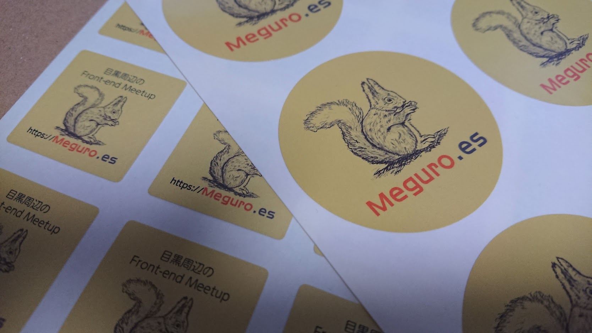

## ステッカーが無くなりそう

[Meguro.es](https://meguro.es) のステッカーは、Hexi https://hexi.pics/ で作っていました。
残念ながら、Hexiはサービス終了してしまいました。

### 二代目を作ろう

コミュニティー活動はモチベーションが最も大切だと思っているので、多少自腹を切ろうとも続けられる何かを見つけるのは大切だと思っています。

ステッカーやノベルティ作成は、広報活動の一環になりますし、モチベーションを保つ1つの方法だと思っているので、二代目を作ろうと思いました。

## ラクスルを使いました

印刷をオンラインで行うサイトはいくつかあると思いますが、
今回は、 [次のMeguro.esの開催場所](https://meguroes.connpass.com/event/104293/) でもある、[ラクスル](https://raksul.com/sticker/) を使いました。

### オンラインで編集できる

オンラインデザインという機能があります。これは、ブラウザ上のエディタで、画像や文字をアップロードして
シールの図面を作成するというものです。

PhotoshopやIllustratorがないとダメなイメージがあったので、ブラウザでデザインが作れるのはありがたいです。

今回は、背景色と画像のアップロードをしてブラウザでデザインをしました。

### 届きました

とどきました！あたりまえですが、編集した通りのものが来ると感激しますね。

丸いステッカーは、100枚で4,000円弱 [^price] でした。納期やカスタマイズ、時期によって変動するかもしれませんのであくまで参考です。

多く作れば単価はもっと安くなっていき、500枚でも11,000円弱ぐらいでできるみたいですので、次はたくさんつくろうと思います。

納得の出来でした！ 次回の勉強会で配り歩きたいと思います。

では[^okotowari]。

[^price]: 3,824円(税込み) 光沢紙(アート)、光沢ラミネート加工（PP）、普通のり、バラ四角カット、オンラインデザイン、50mm X 50mm 、100枚・7営業日後発送の場合。2018年11月10日現在のページから。

[^okotowari]: ※ この記事は Meguro.es の活動を通じた個人の感想であり、個人の時間を使って書かれました。この記事の執筆に関しては、執筆当時の雇用主との関係はありません。

